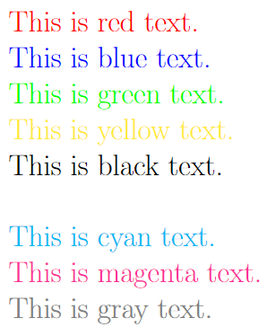

# **Font Size, Style, and Color in LaTeX**
> *🎨✨ Spice Up Your LaTeX Docs with Funky Fonts, Splashy Colors & Sassy Styles! 🚀🎭*

## 1. Font Sizes in LaTeX

LaTeX provides several predefined font sizes that can be used to adjust text size in documents.

### 1. \tiny
> **Command:** `\tiny{Text}`  
> **Use Case:** Small footnotes, disclaimers  
> **Example:**  
> ```latex
> \tiny{This is tiny text.}
> ```

### 2. \scriptsize
> **Command:** `\scriptsize{Text}`  
> **Use Case:** Annotations, captions  
> **Example:**  
> ```latex
> \scriptsize{This is scriptsize text.}
> ```

### 3. \footnotesize
> **Command:** `\footnotesize{Text}`  
> **Use Case:** Footnotes, small captions  
> **Example:**  
> ```latex
> \footnotesize{This is footnotesize text.}
> ```

### 4. \small
> **Command:** `\small{Text}`  
> **Use Case:** Small body text  
> **Example:**  
> ```latex
> \small{This is small text.}
> ```

### 5. \normalsize
> **Command:** `\normalsize{Text}`  
> **Use Case:** Default size for body text  
> **Example:**  
> ```latex
> \normalsize{This is normal text.}
> ```

### 6. \large
> **Command:** `\large{Text}`  
> **Use Case:** Slightly larger text for emphasis  
> **Example:**  
> ```latex
> \large{This is large text.}
> ```

### 7. \Large
> **Command:** `\Large{Text}`  
> **Use Case:** Section titles  
> **Example:**  
> ```latex
> \Large{This is Large text.}
> ```

### 8. \LARGE
> **Command:** `\LARGE{Text}`  
> **Use Case:** Important section titles  
> **Example:**  
> ```latex
> \LARGE{This is LARGE text.}
> ```

### 9. \huge
> **Command:** `\huge{Text}`  
> **Use Case:** Chapter titles  
> **Example:**  
> ```latex
> \huge{This is huge text.}
> ```

### 10. \Huge
> **Command:** `\Huge{Text}`  
> **Use Case:** Main document title  
> **Example:**  
> ```latex
> \Huge{This is Huge text.}
> ```
---

### ***Summary: Available Font Sizes and Their Use Cases***

| Font Size | Command | Use Case |
|-----------|---------|----------|
| \tiny     | `\tiny{Text}` | Small footnotes, disclaimers |
| \scriptsize | `\scriptsize{Text}` | Annotations, captions |
| \footnotesize | `\footnotesize{Text}` | Footnotes, small captions |
| \small    | `\small{Text}` | Small body text |
| \normalsize | `\normalsize{Text}` | Default size for body text |
| \large    | `\large{Text}` | Slightly larger text for emphasis |
| \Large    | `\Large{Text}` | Section titles |
| \LARGE    | `\LARGE{Text}` | Important section titles |
| \huge     | `\huge{Text}` | Chapter titles |
| \Huge     | `\Huge{Text}` | Main document title |

🔹 **Output:** 


---

## 2. Font Colors in LaTeX

LaTeX allows changing text color using the `xcolor` package.

### 1. Red  
> **Command:** `\textcolor{red}{Text}`  
> **Use Case:** Warnings, important notes  
> **Example:**  
> ```latex
> \textcolor{red}{This is red text.}
> ```

### 2. Blue  
> **Command:** `\textcolor{blue}{Text}`  
> **Use Case:** Hyperlinks, references  
> **Example:**  
> ```latex
> \textcolor{blue}{This is blue text.}
> ```

### 3. Green  
> **Command:** `\textcolor{green}{Text}`  
> **Use Case:** Success messages  
> **Example:**  
> ```latex
> \textcolor{green}{This is green text.}
> ```

### 4. Yellow  
> **Command:** `\textcolor{yellow}{Text}`  
> **Use Case:** Highlights  
> **Example:**  
> ```latex
> \textcolor{yellow}{This is yellow text.}
> ```

### 5. Black  
> **Command:** `\textcolor{black}{Text}`  
> **Use Case:** Default text color  
> **Example:**  
> ```latex
> \textcolor{black}{This is black text.}
> ```

### 6. White  
> **Command:** `\textcolor{white}{Text}`  
> **Use Case:** Hidden text (on a white background)  
> **Example:**  
> ```latex
> \textcolor{white}{This is white text.}
> ```

### 7. Cyan  
> **Command:** `\textcolor{cyan}{Text}`  
> **Use Case:** Emphasizing special information  
> **Example:**  
> ```latex
> \textcolor{cyan}{This is cyan text.}
> ```

### 8. Magenta  
> **Command:** `\textcolor{magenta}{Text}`  
> **Use Case:** Highlighting key terms  
> **Example:**  
> ```latex
> \textcolor{magenta}{This is magenta text.}
> ```

### 9. Gray  
> **Command:** `\textcolor{gray}{Text}`  
> **Use Case:** Subdued or secondary text  
> **Example:**  
> ```latex
> \textcolor{gray}{This is gray text.}
> ```

---

### ***Summary: Available Colors and Their Use Cases***
| Color Name | Command | Use Case |
|------------|---------|----------|
| Red        | `\textcolor{red}{Text}` | Warnings, important notes |
| Blue       | `\textcolor{blue}{Text}` | Hyperlinks, references |
| Green      | `\textcolor{green}{Text}` | Success messages |
| Yellow     | `\textcolor{yellow}{Text}` | Highlights |
| Black      | `\textcolor{black}{Text}` | Default text color |
| White      | `\textcolor{white}{Text}` | Hidden text (on a white background) |
| Cyan       | `\textcolor{cyan}{Text}` | Emphasizing special information |
| Magenta    | `\textcolor{magenta}{Text}` | Highlighting key terms |
| Gray       | `\textcolor{gray}{Text}` | Subdued or secondary text |

🔹 **Output:** 


---
## 3. Font Styles in LaTeX
LaTeX provides several font styles to emphasize or format text differently.

### 1. Bold
> **Command:** `\textbf{Text}`  
> **Use Case:** Emphasizing important words  
> **Example:**  
> ```latex
> \textbf{This is bold text.}
> ```

### 2. Italic
> **Command:** `\textit{Text}`  
> **Use Case:** Titles, foreign words  
> **Example:**  
> ```latex
> \textit{This is italic text.}
> ```

### 3. Underline
> **Command:** `\underline{Text}`  
> **Use Case:** Highlighting text  
> **Example:**  
> ```latex
> \underline{This is underlined text.}
> ```

### 4. Typewriter
> **Command:** `\texttt{Text}`  
> **Use Case:** Code snippets  
> **Example:**  
> ```latex
> \texttt{This is typewriter text.}
> ```

### 5. Small Caps
> **Command:** `\textsc{Text}`  
> **Use Case:** Acronyms, headings  
> **Example:**  
> ```latex
> \textsc{This is small caps text.}
> ```

### 6. Slanted
> **Command:** `\textsl{Text}`  
> **Use Case:** Alternative emphasis  
> **Example:**  
> ```latex
> \textsl{This is slanted text.}
> ```

### 7. Emphasized
> **Command:** `\emph{Text}`  
> **Use Case:** Contextual emphasis  
> **Example:**  
> ```latex
> \emph{This is emphasized text.}
> ```

### 8. Roman 
> **Command:** `\textrm{Text}`  
> **Use Case:** Default font for body text  
> **Example:**  
> ```latex
> \textrm{This is Roman (Serif) text.}
> ```

### 9. Sans-Serif  
> **Command:** `\textsf{Text}`  
> **Use Case:** Used for modern-looking text  
> **Example:**  
> ```latex
> \textsf{This is Sans-Serif text.}
> ```
---
### ***Summary: Available Font Styles and Their Use Cases***

| Font Style | Command | Use Case |
|------------|---------|----------|
| Bold       | `\textbf{Text}` | Emphasizing important words |
| Italic     | `\textit{Text}` | Titles, foreign words |
| Underline  | `\underline{Text}` | Highlighting text |
| Typewriter | `\texttt{Text}` | Code snippets |
| Small Caps | `\textsc{Text}` | Acronyms, headings |
| Slanted    | `\textsl{Text}` | Alternative emphasis |
| Emphasized | `\emph{Text}` | Contextual emphasis |
| Roman | `\textrm{Text}`     | Default font for body text |
| Sans-Serif    | `\textsf{Text}`     | Used for modern-looking text |

🔹 **Output:** 


---
## **Conclusion**

This documentation provides a structured overview of LaTeX font customization, including font sizes, colors, and styles, along with examples and a summary table for easy reference.

[← Previous Page](<Essentials, Sections, Titles & Labels.md>) | **5** | [Next Page →](<List,Comments & Spacing, Special Characters.md>)