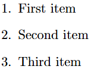
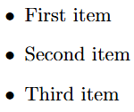
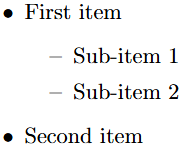
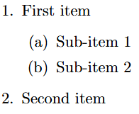
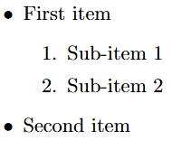
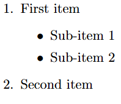
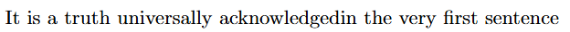
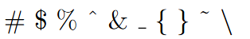

# LaTeX Lists, Comments, Spacing, and Special Characters

> *🚀😄Unleash the power of LaTeX—where lists are neat, spaces behave, comments stay silent, and special characters feel extra special! 😄🚀*

## Lists in LaTeX
LaTeX supports two types of lists:

- **Enumerate**: Produces numbered lists.
- **Itemize**: Creates bulleted lists.

Each list item is defined by `\item`. Lists can be nested to produce sub-lists.

### 1. Ordered List (Numbered)
```latex
\begin{enumerate}
    \item First item
    \item Second item
    \item Third item
\end{enumerate}
```
🔹 **Output:**



### 2. Unordered List (Bulleted)
```latex
\begin{itemize}
    \item First item
    \item Second item
    \item Third item
\end{itemize}
```

🔹 **Output:**



### 3. Nested List
#### 3.1. Unordered List
```latex
\begin{itemize}
    \item First item
    \begin{itemize}
        \item Sub-item 1
        \item Sub-item 2
    \end{itemize}
    \item Second item
\end{itemize}
```

🔹 **Output:**



#### 3.2. Ordered List
```latex
\begin{enumerate}
    \item First item
    \begin{enumerate}
        \item Sub-item 1
        \item Sub-item 2
    \end{enumerate}
    \item Second item
\end{enumerate}
```

🔹 **Output:**



#### 3.3. Unordered - Ordered List
```latex
\begin{itemize}
    \item First item
    \begin{enumerate}
        \item Sub-item 1
        \item Sub-item 2
    \end{enumerate}
    \item Second item
\end{itemize}
```

🔹 **Output:**



#### 3.4. Ordered - Unordered List
```latex
\begin{enumerate}
    \item First item
    \begin{itemize}
        \item Sub-item 1
        \item Sub-item 2
    \end{itemize}
    \item Second item
\end{enumerate}
```

🔹 **Output:**



### Custom Bullet Symbols
It is easy to change the bullet symbol using square brackets after `\item`:
```latex
\begin{itemize}
    \item[-] Dash bullet
    \item[One] Custom word bullet
\end{itemize}
```

🔹 **Output:**


---

## Comments & Spacing

### Comments
- Comments are created using `%`.
- When LaTeX encounters `%`, it ignores the rest of the line.
- Used for writing notes that won’t appear in the final document.

**Example:**
```latex
It is a truth universally acknowledged% Note comic irony
in the very first sentence
```
🔹 **Output:**



### Spacing Rules
- Multiple consecutive spaces are treated as a single space.
- Several empty lines are treated as one empty line.
- An empty line starts a new paragraph.
- Use `\\` for a new line.
- Use `\vspace{12pt}` for adding blank vertical space.

Example:
```latex
Hello,\vspace{12pt} World!
```

---

## Special Characters in LaTeX
The following symbols are reserved and have special meanings in LaTeX:
```
# $ % ^ & _ { } ~ \
```
To use them as regular characters, prefix them with `\`:

**Example:**
```latex
\# \$ \% \^{} \& \_ \{ \} \~{} \textbackslash
```
The backslash `\` cannot be prefixed like this, use `\textbackslash` instead.

🔹 **Output:**



---
## Conclusion
Now that you've mastered lists, comments, spacing, and special characters in LaTeX, you're well on your way to creating beautifully formatted documents. Keep experimenting, and soon you'll be a LaTeX pro! 🚀

[← Previous Page](<Font Size,Style and Color.md>) | **6** | [Next Page →](<Tables.md>)
